# TH-Paint

This is a basic bitmap-based painting progam I wrote for my Atari-ST in 1987-1988.

## Drawing Tools (Shapes)

The `Shapes` menu is used to select the drawing tool. For drawing you first
need to open a new window (via the File menu, see next chapters).  Then a mouse
click into the window applies the tool. For many of the shapes you need to keep
the mouse button pressed and drag it, namely for defining the dimension of the
drawn object.

In general, each shape has a configuration dialog in the `Attributes` menu.
Enabling of filling and border drawing is done via the checkmarks in the Shapes
menu directly. This is covered in detail in the following table.

| Shape | Description |
|:------|:------------|
| Pencil | With a single mouse click this shape draws a single pixel. Pencil attributes allow changing color and size of the dot. When the mouse is dragged, the shape draws lines connecting the previous mouse position with the last. The XOR combination mode can be applied; it works as expected for single dots, but will lead to dotted lines when dragging due to the overlapping nature of consecutive lines. |
| Stencil | This is a variant of the Pencil which has no separate entry in the Shapes menu, but rather is selected via Pencil attributes. You can choose between shapes plus sign, star, square, cross and diamond. With a single mouse click the symbol is drawn once centered at the mouse position. When dragging the mouse, the symbol is repeatedly drawn at each new position. Size and color of the symbols is configurable; XOR combination mode can be applied, but the same caveat as for pencil applies. |
| Brush | This is a "free-hand" drawing tool similar Pencil, however with an configurable, usually asymmetric, tool shape. A single click using this shape draws nothing; you have to move the mouse for drawing. When moving, for the asymmetric tool shapes, drawing is done by filling the area defined by 4 corners of old mouse position plus/minus offsets defined by tool shape, and new mouse position plus/minus the same offsets. For the "O" shaped brush, drawing is done by drawing a line with rounded ends - which is equivalent to pencil. Within the attributes dialog you can configure the shape, width and color. For asymmetric shapes also the fill pattern is applicable, and combination modes work as described in the following for rectangles. |
| Spraycan | Draws individual pixels at random positions within a fixed radius around the current mouse position for as long as the mouse button is pressed. Ultimately, if the mouse button is pressed long enough and the mouse not moved a filled circle is the result. The spray radius and color is configurable. The general combination modes do not apply; instead special modes can be configured in the spraycan attributes dialog: With `NOT x` each drawn pixel inverts the previous drawn pixel or background at the position; this leads to completely random pixelation within the spray radius. With `INV` each pixel is given the inverse color of the original background from before start of spraying; this leads to equivalent look as you'd get from non-freehand shapes such as rectangle in XOR combination mode. |
| Floodfill | Fills the canvas starting at the position of the mouse click with the color and pattern configured via attributes. When fill color is configured as black, then all white pixels that are reachable from the origin are filled; when fill color is white then all reachable black pixels are filled. Here "reachable" means not just straight lines, but also around corners. Be warned that this function may be slow (e.g. when spraycan was used) and is not interruptible. The fill pattern defined via attributes is applied. Combination mode attributes have no (useful) effect, as the filling is done only within regions having background color. |
| Text | After clicking into the image with the mouse, text characters can by typed using the keyboard and will appear to the right of the clicked mouse position. The `Backspace` key can be used to erase the last typed character (within the current line; use `Undo` to remove all lines of text). The `Return` key starts a new line one row below the original position of the mouse click. Text attributes need to be configured before starting to enter text (i.e. they will apply only after defining a new start position with another mouse click.) In addition to text attributes, all the combination modes can be applied; In particular in transparent mode the text area is not filled with background color before drawing the characters. Text entry is ended when clicking with the mouse outside of the image area (e.g. on the window title bar). |
| Eraser | Draws a white square around the mouse positon. When the mouse is dragged the square keeps being drawn around each new position. The color and size are configurable. |
| Rubberband | The shape only draws when the mouse is dragged. Then it draws a line from the position of the original position where the mouse button was pressed to the latest position of the mouse. All the regular line attributes (width, color, pattern, line end styles) are applied. XOR combination mode can be applied, but the same caveat as for pencil applies. |
| Line | With the line shape (and all following shapes) drawing is done in two phases: At first, while the mouse button is kept pressed, only a dotted line is drawn between the original and current mouse position. This line only serves to mark where the line will be drawn. Once the mouse button is released, the dotted line is removed and the actual line is drawn using the configured color, width, line pattern and start/end style attributes. The combination mode attribute also is applicable; transparent mode only makes a difference when using line patterns with gaps. |
| Rectangle | While the mouse button is kept pressed, a dotted rectangle between the original and current mouse positions is drawn (where the two mouse positions define opposite corners of the rectangle). Once the mouse button is released, the dotted lines are removed and the final rectangle is drawn. The options at the bottom of the shapes menu determine if the border is drawn (default), or if the area is filled, or both. When the border is drawn, all attributes as described for line shapes are applicable, except for start/end style. When filled, the configured fill color and pattern is applicable. When both border and filling is requested, line attributes are not applied but instead the border is drawn as a solid line in the fill color. The options at the bottom of the Shapes menu allow specifying rounded corners; this applies both to the filling and drawn border. The general combination mode is applied: For straight border and opaque fill pattern (i.e. filled black or white) only XOR is useful; when patterns with gaps are, the transparent mode can be enables to make the background image visible at pixels where the pattern has "gaps" (i.e. not the foregroud/fill color). In "Reverse transparent" combination mode the pattern is first inverted and then gaps in the pattern forground are made transparent. |
| Square | This shape is equivalent to rectangle, except that width and height are kept identical. Specifically, the lower value between width and height is used for both dimensions. |
| Polygon | Allows drawing complex geometric shapes consisting of up to 128 corners. Unlike for other shapes, the mouse button is released during drawing to define the corners: The position of the initial mouse click and the position upon release of the mouse button defines the first line. (Note releasing the mouse button without movement will currently draw a single dot and not allow adding further corners.) Each subsequent mouse click specifies an additional corner. While the mouse is moved, a dotted line is drawn between all previously defined corners, the current mouse position, and back from the mouse position to the origin. During this process the `Backspace` key will remove the last defined corner. Specifying corners is ended by pressing the `Return` key; the position of the mouse at the time of pressing the key defines the last corner. Afterwards the dotted lines are removed and the polygon is drawn using the configured line and fill attributes, equivalently as for rectangles, except that rounded corners are not supported and line start/end style is applied (however only for the line connecting the last two corners). Note intersection of lines defining the polygon is supported even when filling the polygon. |
| Circle | While the mouse button is kept pressed, a dotted circle is drawn, where the original mouse position defines the center and the current mouse position a point on the circumference of the circle. Once the mouse button is released, the dotted line is removed and the final circle is drawn. Border and fill attributes are applied equivalently as for rectangles. Additionally the circle can be limited to an arc using the `Segment` entry in the shapes menu, which allows specifying starting and end angles in 10th of degrees (i.e. range 0 to 360, counter-clockwise with origin in location of East). It's possible to define an arc spanning across the 0 degree location by specifying an end degree which is smaller than the start degree (e.g. 270,0 to 90,0). Note the line end styles are normally applied at degree 0 for a full circle. To get them drawn at another position on the radius, define an arc spanning from that degree to an end degree that is 0,1 less. |
| Elipsis | This shape is equivalent to circle, except that vertical and horizontal radius can be different. The original position of the mouse defines the center of the ellipse; the last position of the mouse defines the radii via the absolute of the horizontal and vertical delta to the original mouse position. The same attributes and arc segment configuration as for circles is applicable. |
| Curve | This shape is not implemented yet. It was intended for drawing Bezier curves (using the respective VDI functionality). Each segment of the curve is defined by 4 points, where two lie on the curve and two others define the angle of the curve through those points. Equivalent to polygon, a curve can be built from multiple segements. In this case adjacent segments share one end point and corresponding angle vector. |

## Attributes

*Combination modes*: This dialog offers a choice between Replace, Transparent,
XOR, and Reverse Transparent. By default the first is selected, which means
shapes are opaque and cover the backgound image on top of which you are
drawing.  In transparent mode, the background image remains visible whereever
your drawing shape has gaps (i.e. pixels are bit-wise OR of background and
foreground). Such gaps only occur when using line or fill patterns.  XOR mode
means pixels are inverted when they are both set in background and forground
image (e.g. when you draw a shape that is filled solid black, the effect is
that the background image in that area remains visible in inverse).  With
reverse transparent mode the drawing shape is inverted and then made
transparent.

Note the combination mode configuration in the attributes menu only applies to
the drawing shapes in the Shapes menu. For selections there is a separate
configuration dialog in the Selections menu which has more combination modes.
In that menu "Z = Q" is equivalent "Replace"; "Q OR Z" is equivalent
transparent; "Q XOR Z" equivalent XOR; "Reverse transparent" equivalent
"Q OR (NOT Z)"

*Fill pattern*: This dialog defines the pattern that is used when enabling the
"Fill shapes" option for rectangle, square, etc. It also applies for the brush
and flood-filling. The dialog window shows the currently selected pattern in a
boy at the upper left. You can cycle through pre-defined patterns using the "+"
and "-" buttons next to the box. Alternatively, you can edit the style and
index numbers directly. For applying a user-defined pattern, change the style
number to 4 and edit the pattern by clicking on pixels in the bog box at the
right. The demo box at the left will show how the pattern looks like after each
change.

*Line attributes*: This dialog defines the pattern used for drawing with the
line shape, or borders of rectangles etc. when not filled. When selecting
color, 1 means black and 0 white. Line widths should be odd numbers. The
"style" selection allows selecting pre-defined patterns numbered 1-6, or
user-defined pattern numbered 7. Click into the demo box at the upper-right to
see a demo of the line pattern. You can edit the user-defined pattern by
clicking on pixels in the small box below the demo box. While "style 7" is
selected on the left, the demo box is updated with the user-defined pattern
after each change.  Finally, the start and end settings determine the look of
line ends. Here "normal" means there is no decoration at line ends; for
"rounded" an extra "dot" is drawn at the end points (i.e. unlike rounded
rectangles this makes the shape extent larger); with "arrow" and arrow is added
on top of the ends.  (In XOR mode you can see that these end shapes are drawn
separately on top of the drawn line, thus XORing with the line itself.)

The other attributes have already been described above together with the shapes
they apply to.

## Working with selections

To start a selection first check `Select region` in the `Selection` menu. Then
by clicking and dragging the mouse in the image window you can select a
rectangle as selected area. The rubberband rectangle will remain when you
release the mouse button to keep the area marked (but it does not become part
of the image). Once a selection is done, all the selection commands in the
`Selection` menu become enabled. The selection is ended either by clicking
with the mouse outside of the selection frame, or by selecting a different
shape from the shapes menu. (Hint: to erase or fill non-rectangular regions
you can use a polygon shape.)

The most basic operation on selections is moving them. To do so click with
the mouse anywhere within the selected region and drag it. The specific behavior
depends on the options described below.

| Operation | Description |
|:----------|:------------|
| Paste | Inserts a copy of the last selected area within a selection frame. |
| Discard | Discards the selection frame including its content, thus making the background below the selection visible. |
| Commit | This command is only available when a combination mode is enabled, or while the selection frame is cut off at a window border. In these cases this command copies the current size or combined content into the selection overlay. (This is equivalent to ending the selection and the selecting the exact same region again. |
| Erase | Fill the selection frame with white color. |
| Fill black | Fill the selection frame with black color. |
| Invert | Invert the content of the selection frame. |
| Mirror | Mirrors the content of the selection frame along a vertical or horizontal axis. |
| Rotate | Rotates the selection frame. The result is inserted in the middle of the window in a resized frame. |
| Zoom | Scales the selection frame and content by given factors in X And Y axis. In fixed mode the result is inserted as a resized selection frame in the middle of the window. In manual mode there is a switch into full-screen mode, where you can determine the desired scale by dragging the mouse. |
| Distort | In the simplest mode, the selection frame is slanted horizontally or vertically, but there are several more functions. More specifically, each line or row of pixels in the selection frame is shifted by an amount of pixels which is determined by a function (e.g. a linear function in case of the basic slant.) |
| Projection | This feature is not implemented yet. It was intended to allow projecting the selection content onto the surface of various geometric shapes and render a 2D view onto these shapes. |

The remaining three entries are options. They do not modify the selection
area directly, but rather change the way selection operates:

| Option    | Description |
|:----------|:------------|
| Copy | When enabled, the selected area is not cleared when a selection is started. Therefore a copy of the selected area is both in the background layer and in the selection layer. This may be useful when copying many parts of the image. It also is useful when working with combination modes, for example to create a shadow effect by using XOR and moving the image a small X/Y delta. |
| Combine | Open a dialog where you can select combination modes between selection frame content and the background layer (i.e. the rest of the image on top of which the selection frame resides). By default the selection is opaque. In all other modes the content of the selection frame changes whenever you move it. Note in overlay mode the result of combination is not copied to the selection layer, which means the actual selection content remains unchanged until you end the selection; at that time the result of the last combination is copied into the image. |
| Overlay Mode | This option is enabled by default. When *enabled* and a selection is started, the selected region of the image is cut out of the image and copied into a separate layer. When the selection frame is moved or otherwise modified, the rest of the image is not affected. Only when the selection is ended the selection frame content is copied into the image. When *disabled* the selection content is copied back into the image immediately after moving it (i.e. upon releasing the mouse button) or after any transformation. This is useful only in special cases, such as when working with combination modes such as XOR. |

The following table explains the combination modes supported by selections:

| Mode      | Description |
|:----------|:------------|
| Z := Q             | The selection layer is inserted on top of the image without combining with the background image. |
| Z := Q AND Z       | Pixels are set only if set in the background and the selection image. |
| Z := Q XOR Z       | Pixels are set at a position if they are set in the corrsponding position either in selection or the background, but not both. For example if your selection is entirely black, the selection frame will show the inverse of the background. |
| Z := Q OR Z        | Pixels are set if they are set at that position either in the selection or the background image. This mode is equivalent to "transparent" combination mode for filled shapes (see above). |
| others | Similar as above, but using inverted pixel of either selection (Q), background (Z), or combination result. |

## Undo operation

TH-paint supports undoing only the very last drawing operation. When using
`Undo` in the File menu a second time, the change is re-applied. Also note
that changing between windows will clear the undo buffer (as there is only
a single such buffer shared by all windows).

## File operations

| Operation | Description |
|:----------|:------------|
| Undo | As explained above, this command undoes or redoes the last change to the image in the current window. |
| Discard image | Clear the content of the current window. This command asks for confirmation if the content was modified. |
| New window | Open a new, empty window. This is usually the first used command after starting the program. |
| Load image | Load an image from a file. Supported formats are LOGO format, DEGAS format, or a raw format written by TH-Paint by default. The first two formats are automatically detected (due to lack of a header the raw format cannot be detected; you are able to load any kind of file as an image). |
| Save as | Store the image of the current window into a file. A dialog is opened to query for a file name. By default a raw format is used that stores the image row by row as a stream of pixels. The size of the stored image and other image formats can be selected in the Attributes menu. |
| Save | This command is enabled when the image was loaded from a file, or already stored via "Save as". The command stores the image to the same file, but still asks to confirm overwriting it. Note the file format is not rememberd from the time of loading the file, so the command defaults to raw mode unless a different format is selected in the Attributes menu. |
| Print | This command sends the image to a printed. The print can be stopped by pressing the ALT key. Note while printing other functions of the program cannot be used. Before using this command you'll normally want to configure the output using the respective dialog in the attributes menu. You can select between portrait and landscape orientation, as well if only parts of the image shall be printed. For some printers you may also need to apply a scaling to preserve the aspect ratio; for this purpose it's supported to stretch the image in printing direction by factor 1.5 or 2. |
| Quit | Terminate the program. The command asks for confirmation if the content of any windows was modified. |

## Additional tools

| Operation | Description |
|:----------|:------------|
| Save coordinates | Checking this option disables the current drawing shape or selection. Otherwise nothing will happen; likely this feature was not implemented yet. |
| Coordinates | This feature is not implemented yet, although the command opens a dialog asking for entering a number of coordinates depending on the currently selected drawing shape (but after doing so nothing will happen). It was intended to allow drawing shapes such as lines or rectangle with manually specified coordinates instead of using the mouse. |
| Zoom view | This feature is not implemented yet. It was intended for allowing to zoom the view of the image. |
| Full-screen mode | TH-Paint supports a full-screen mode where you can draw without the constraint of window borders and menu. You can quickly toggle between normal and full-screen mode by clicking into a window with the right mouse button. The menu command only displays a note pointing out this option. |
| Cross mouse shape | When this option is checked, the mouse shape has the form of a cross instead of the default pointer. The cross may be helpful when you need to precisely hit a pixel. |
| Show mouse coordinates | When this option is checked, the mouse coordinates are constantly displayed in the right corner of the menu bar. The coordinates are relative to the root of the image in the current window. When the mouse is moved outside of an image window only dashes are shown. |
| Snap to grid | When this option is checked, the mouse position is rounded to the closest position in the grid for all operations (without actually moving the mouse pointer to this position). This is useful for alinging start and end of multiple drawing operations. It can also be used for creating effects with freestyle tools such as the pencil (e.g. a stair effect when drawing diagonally). |
| Grid setup | Allows configuring the grid spacing as well as the grid origin. |

## Examples

|     |      |      |      | Description |
|:----|:-----|:-----|:-----|:------------|
| 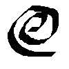 |  | 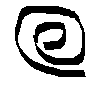 | 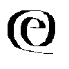 | Brush shapes "/", "\", "\|" and "-" |
| 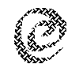 |  | 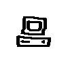 | 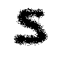 | Brush with fill pattern; Outline created with XOR selection overlay; Pencil width 3; Spraycan |
| 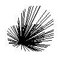 | 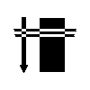 |  | 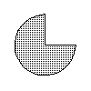 | Rubberband, Lines width 3 with arrow and XOR across rectangle; pattern-filled rounded rectangle; filled arc |
| 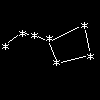 | 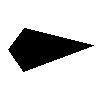 | 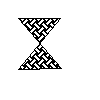 | 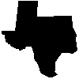 | Stencil shape "star"; Simple filled polygon; Filled intersecting polygon; Complex filled polygon |
